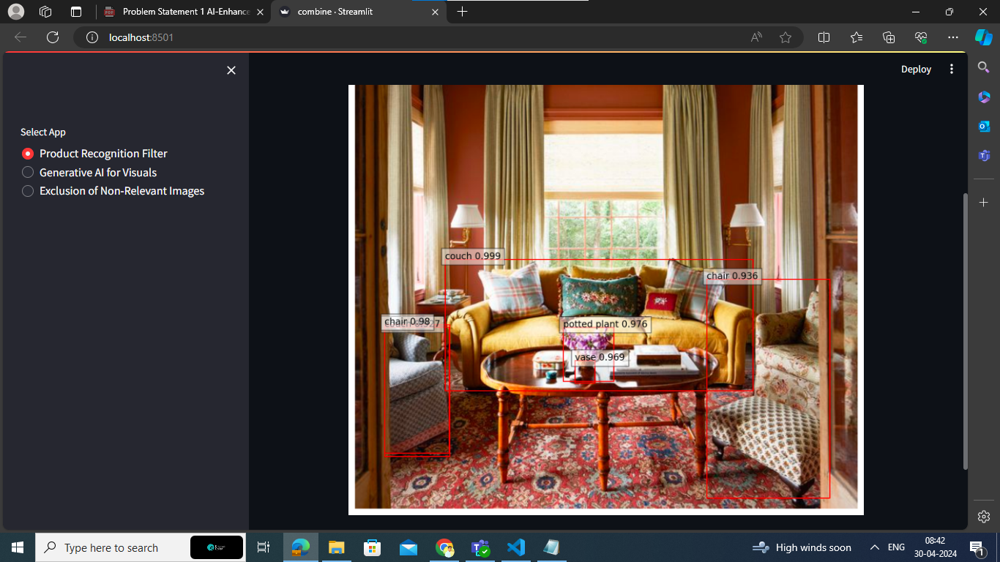
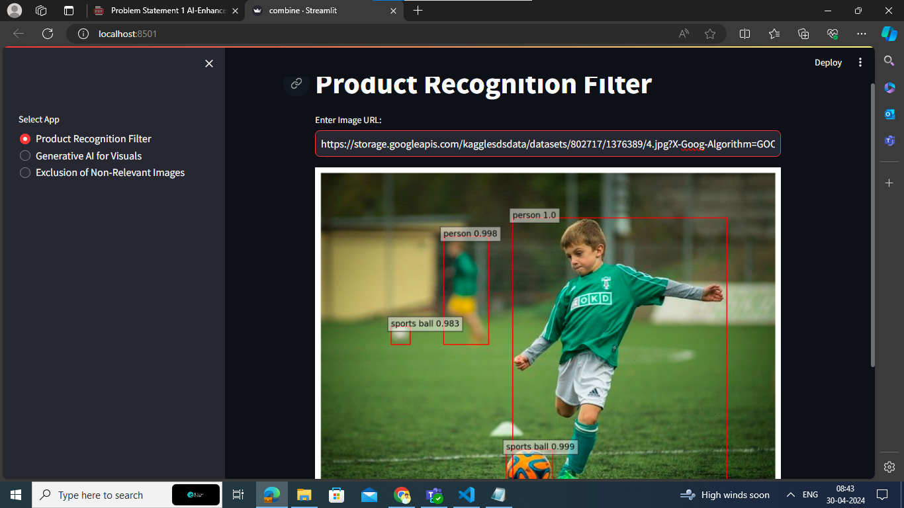
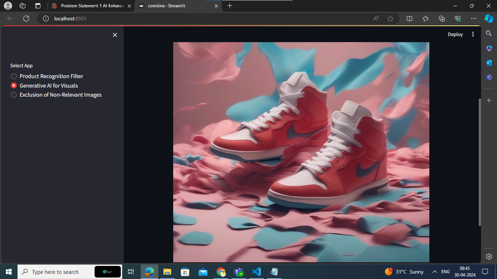
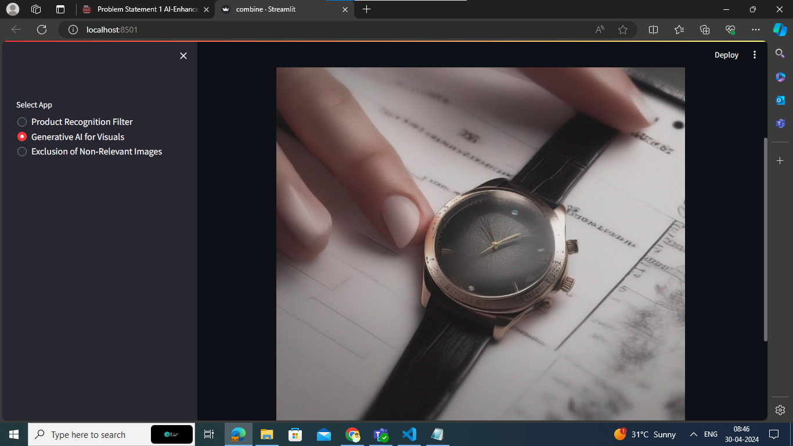
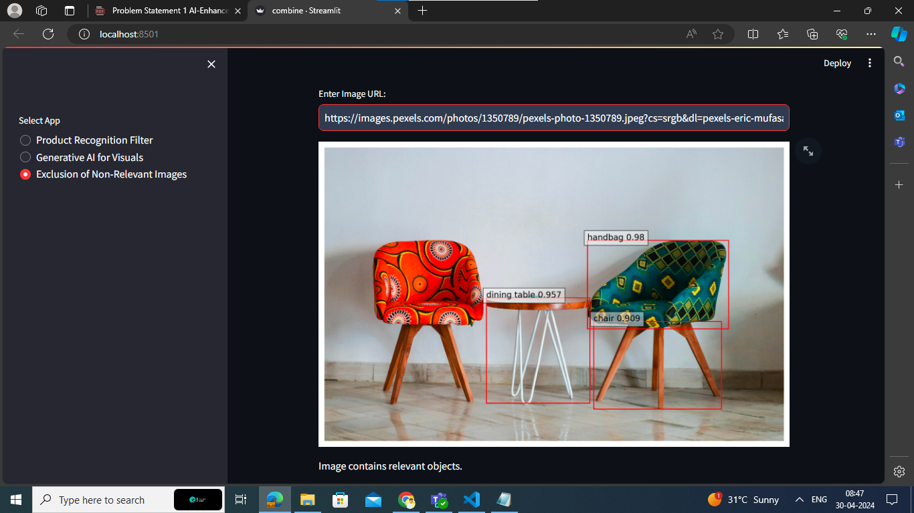

# AI-Enhanced Product Photoshoot Visuals and Filter

## Overview

## Product Visual AI

This project implements various functionalities related to product visuals using Streamlit and Hugging Face Transformers. It includes:

## Product Recognition Filter: 
This feature allows users to input an image URL and uses the DETR model to detect and classify products in the image.

## Generative AI for Visuals: 
This feature generates an image based on a text description using the Stable Diffusion XL model.

## Exclusion of Non-Relevant Images: 
This feature analyzes an image to determine if it contains relevant objects based on a predefined list of labels.

## Installation

## Clone the repository:

git clone https://github.com/your-username/product-visual-ai.git

## Install the required Python packages:

pip install -r requirements.txt

## Usage
## Run the Streamlit app:

streamlit run app.py
Select the desired functionality from the sidebar and follow the on-screen instructions.

## Acknowledgements

This project uses the Hugging Face Transformers library for the DETR model and the Stable Diffusion XL model.
The DETR model is used for object detection and classification in product images.
